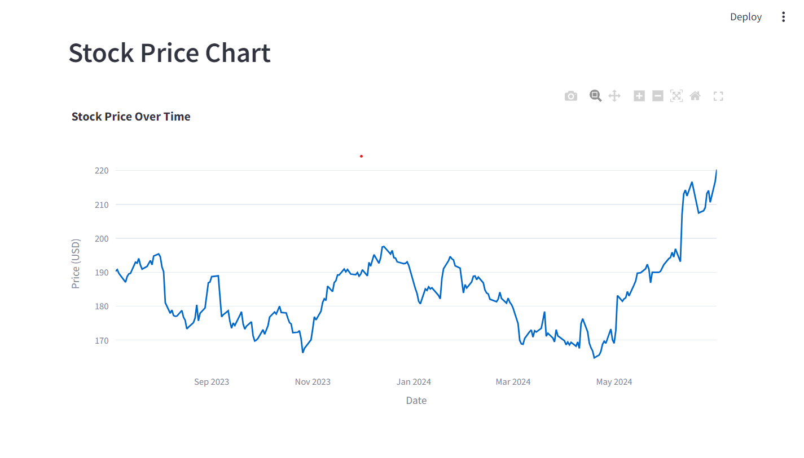
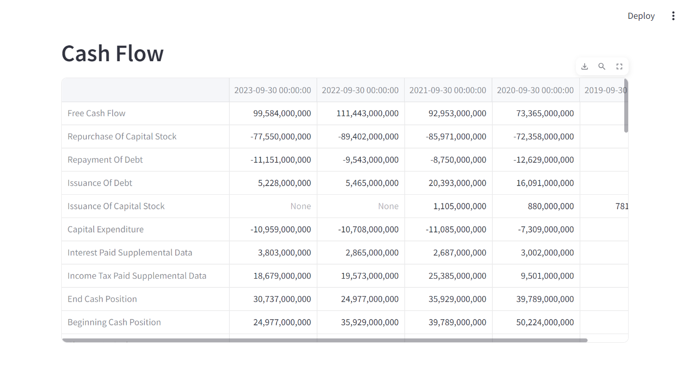
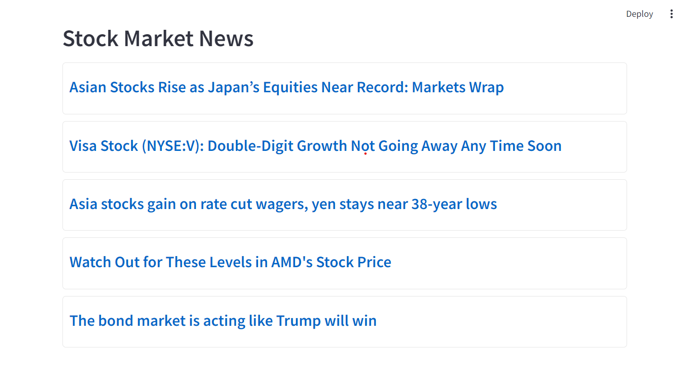

# Streamlit_Stock_Analysis
The Stock Market Application is a Streamlit-based web app that provides detailed stock information. Users can input a stock symbol to view historical prices, valuation metrics, financial highlights, balance sheets, and cash flow. It also features the latest market news from Yahoo Finance, making it a comprehensive tool for stock analysis.

